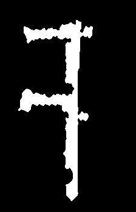
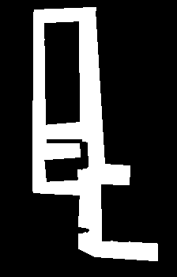
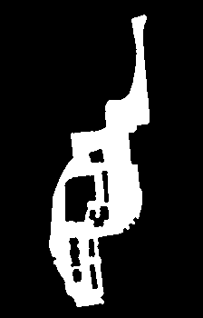
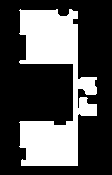

The code in this repo is used in the publication **"Next-Best-Smell: a multi-criteria robotic exploration strategy for Radio Frequency IDentification tags discovery"**

<pre>
<b>Abstract:</b> Automated exploration is one of the most relevant applications for autonomous robots. In this paper, we propose a novel online coverage algorithm calledNext-Best-Sense (NBS), an extension of the Next-Best-View class of exploration algorithms which optimizes the exploration task balancing multiple criteria.NBS is applied to the problem of localizing all Radio FrequencyIdentification (RFID) tags with a mobile robot. We cast this problem as a coverage planning problem by defining a basic sensing operation – a scan with the RFID reader – as the field of “view” of the sensor. NBS evaluates candidate locations with a global utility function which combines utility values for travel distance, information gain, sensing time, battery status andRFID information gain, generalizing the use of Multi-CriteriaDecision Making. We developed an RFID reader and tag model in the Gazebo simulator for validation. Experiments performed both in simulation and with a prototype robot suggest that ourNBS approach can successfully localize all the RFID tags while minimizing navigation metrics, such sensing operations, total traveling distance and battery consumption. The code developed is publicly available on the authors repository.
</pre>

The criteria used in NBS are the followings:
- Information gain (IG), computed as the number of free unscanned cells that the robot will be able to sense from the candidate pose. 
- Travel distance (TD), the distance between the current robot pose and the candidate pose.
- Sensing time (ST), the time required to sense all the free unscanned cells sensable from the candidate pose.
- RFID Information gain (RFID), corresponding to the amount of uncertainty with reference to a RFID tag position in the proximity of the considered pose.
- Battery Status (BS)}, the expected amount of battery charge left after reaching the candidate pose.

### Installation

First, proceed to clone the repository 

``` bash
git clone https://github.com/LCAS/nbs.git
```

Then proceed to create a build folder and compile the project

``` bash
cd nbs
mkdir build
cd build
cmake ..
make
```

### (Quick) Usage

The folder `scripts` contains useful bash scripts for testing the applications. In particular, `test.sh` can be used to run NBS on one of the environment provided. Please uncomment the corresponding line and simply invoking the following commands (assuming to be in the root of the project)

``` bash
bash script/test.sh
```

The results are generated (by default) in the `/tmp` folder.

### (Deep) Usage

Next-Best-Sense requires quite a lot of parameters to be run and, at the current stage, most of them are passed over command line. An command example is provided now:

``` bash
$  ./build/mcdm_online_exploration ./Images/inbeng_small.pgm 1 55 41 180 12 180 0.99 0 1 ./config/tag_inbeng_2.yaml 902e6 0 0.1 0.6 0.1 0.1 0.1 /tmp/result_inbeng.csv /tmp/coverage_mcdm_inbeng.csv /tmp/distance_tag.csv 1 /tmp/accuracy.csv 1
```

where:
- `./build/mcdm_online_exploration` is the executable file
- `./Images/inbeng_small.pgm` is the image file you want to use
- `1` means we are using the full resolution of the map, without resizing it
- `55` and `41` are the coordinates of the starting position of the robot
- `180` is the initial orientation of the robot
- `12` is the sensor range expressed in cells
- `180` is the maximum scan angle
- `0.99` means we want the full coverage ( use 0.9X with a lower resolution)
- `0` is the threshold factor for discarding frontiers and speeding up the exploration (us 0.XX for different values)
- `1` means we use cells of one square meter per size during the navigation
- `./config/tag_inbeng_2.yaml` is the file containing the position of 10 RFID tags
- `902e6` and `0` are the frequency (hz) and transmitted power (dB) for the RFID scan
- `0.1 0.6 0.1 0.1 0.1` are the w_info_gain, w_travel_distance, w_sensing_time, w_rfid_gain respectively
- `/tmp/result_inbeng.csv` is the path where to save the final result
- `/tmp/coverage_mcdm_inbeng.csv` is the path where to save increasing coverage results
- `/tmp/distance_tag.csv` is the path where to save the distance from each RFID tags
- `1` use for building the ellipse in the radiation model, how many cells behind the robot can be sensed
- `/tmp/accuracy.csv` is the path where to save detection accuracy results
- `1` boolean to use mcdm (1) or the weighted_average (0) as aggregation function

### MAPS DETAILS


| Environment  | [OREBRO](./Images/orebro_small.pgm)  | [INB_3123](./Images/inb3123_small.pgm)  | [INB_ENG](./Images/inbeng_small.pgm) | [INB_ATRIUM](./Images/inbatrium_small.pgm)  | [NCFM](./Images/ncfm_small.pgm) |
|:---:|:---:|:---:|:---:|:---:|:---:|
| Map  |   |  |   |   |  |
| Size | 200x200  | 200x200  | 200x200  | 200x200  | 200x200 |
| Resolution  | 0.5  | 0.5  | 0.25  | 0.33  | 0.25 |
